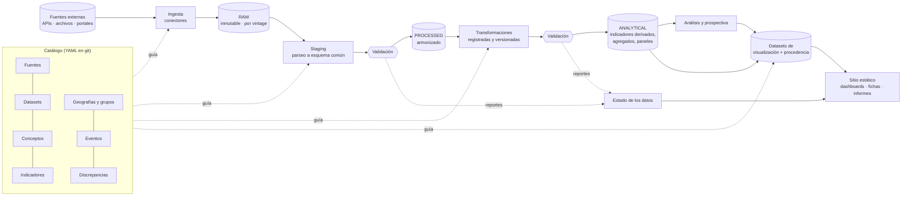

# 02 · Arquitectura general

## 1. Objetivos del sistema

### Objetivos analíticos

Permitir que una persona responda, con evidencia rastreable, preguntas sobre la
trayectoria, la situación actual y los futuros posibles de México, América Latina y el
Caribe y el mundo, en las dimensiones política, económica, social, de seguridad,
energética, tecnológica e internacional.

### Requisitos no funcionales

| Requisito | Qué significa en la práctica |
|---|---|
| **Trazabilidad** | Toda cifra publicada se puede seguir hasta el archivo original descargado (gráfica → dataset de visualización → transformación → serie procesada → archivo crudo → URL y fecha). |
| **Reproducibilidad** | Con el repositorio, el *lockfile* de versiones de datos y el archivo de datos crudos, cualquiera puede reconstruir el sitio de una fecha dada. |
| **Inmutabilidad de lo crudo** | Los datos originales nunca se modifican ni se sobrescriben; cada descarga es una versión nueva. |
| **Modularidad** | Agregar una fuente, un indicador o una gráfica no requiere modificar el resto del sistema. |
| **Degradación elegante** | Si una fuente falla, el sistema sigue funcionando con la última versión válida y lo indica. |
| **Bajo costo y bajo mantenimiento** | Operable por una o dos personas; sin servidores propios; costo cercano a cero en la fase inicial. |
| **Apertura** | Código abierto; datos derivados publicados cuando la licencia lo permite. |
| **Longevidad** | Formatos abiertos (Parquet, CSV, YAML, Markdown) y herramientas con comunidad amplia. |

## 2. Preguntas analíticas rectoras

Las preguntas organizan el sistema. Cada módulo existe para responder alguna.

| Familia | Preguntas tipo | Módulo principal |
|---|---|---|
| **Trayectoria** | ¿Cómo ha cambiado México en 30–50 años? ¿Qué mejoró y qué se deterioró? | Análisis temporal |
| **Posición** | ¿Dónde está México respecto a ALC, a sus pares y a la OCDE? ¿Cómo ha cambiado esa posición? | Análisis comparativo |
| **Estructura vs coyuntura** | ¿Qué problemas son estructurales (persistentes y lentos) y cuáles coyunturales? | Descomposición tendencia-ciclo, ventanas múltiples |
| **Cambio** | ¿Qué indicadores están cambiando rápido, en relación con su variabilidad histórica? | Detector de cambios |
| **Eventos** | ¿Qué cambió después de un evento? ¿Qué ocurrió antes en situaciones similares? | Línea de tiempo de eventos, estudios de evento, análogos históricos |
| **Relaciones** | ¿Qué variables se mueven juntas y bajo qué condiciones? | Correlaciones, descomposiciones contables |
| **Prospectiva** | ¿Qué trayectorias son posibles bajo distintos supuestos? ¿Qué tan buenos han sido los pronósticos? | Módulo de prospectiva |
| **Evidencia** | ¿Qué evidencia hay a favor y en contra de una interpretación? | Mapa de evidencia (fase 3) |

## 3. Vista general



## 4. Componentes

### 4.1 Catálogo (metadatos curados)

La **fuente de verdad** sobre qué medimos y cómo. Vive en `catalog/` como YAML legible,
versionado en git y validado con esquemas (Pydantic). Contiene:

- `sources/`: organizaciones productoras (mandato, contacto, licencia, calendario de publicación).
- `datasets/`: productos concretos (WDI, ENOE, V-Dem v16…), con URL, método de acceso,
  frecuencia, cobertura, política de revisiones, rupturas conocidas y limitaciones.
- `concepts.yaml`: la taxonomía (dimensión → subdimensión → concepto).
- `indicators/`: fichas de indicador con definición, unidad, dirección normativa, series
  que lo miden y, si es derivado, su **receta** de cálculo.
- `geographies/`: códigos, tablas de equivalencias (ISO3, M49, códigos del Banco Mundial y del FMI,
  COW, V-Dem, INEGI) y **grupos de comparación** con vigencia temporal.
- `events/`: línea de tiempo curada (elecciones, cambios de gobierno, crisis, reformas,
  choques externos), cada evento con fuente y criterio de inclusión.
- `discrepancies/`: diferencias documentadas entre fuentes y su explicación.
- `vintages.lock.yaml`: qué versión de cada dataset usa la publicación vigente.

### 4.2 Ingesta

Un **conector por fuente** con una interfaz común. Descarga, calcula el hash, guarda los
bytes originales y un manifiesto. No interpreta los datos. Detalles en
[06 · Pipeline](06-pipeline-y-validacion.md).

### 4.3 Almacenamiento por zonas

| Zona | Contenido | Formato | Mutabilidad |
|---|---|---|---|
| `raw` | Bytes originales + manifiesto | Original (CSV, XLSX, JSON, ZIP…) | Inmutable, una carpeta por versión |
| `staging` | Parseo literal al esquema común (códigos de la fuente) | Parquet | Regenerable desde `raw` |
| `processed` | Observaciones armonizadas (geografía, unidades, periodos, estatus) | Parquet particionado | Regenerable |
| `analytical` | Indicadores derivados, agregados regionales, paneles | Parquet | Regenerable |
| `viz` | Datos mínimos por gráfica + archivo de procedencia | Parquet/JSON pequeños | Regenerable |
| `warehouse.duckdb` | Vistas SQL sobre todo lo anterior para consulta | DuckDB | Desechable, reconstruible |

Solo `raw` necesita respaldo; todo lo demás se reconstruye de forma determinista.

### 4.4 Procesamiento y armonización

Convierte cada dataset al **modelo canónico de observaciones** (abajo): mapea códigos
geográficos, normaliza unidades y multiplicadores, normaliza periodos y traduce las banderas
de estatus de la fuente (preliminar, estimado, proyectado…).

### 4.5 Validación

Controles automáticos en varias "compuertas" del pipeline, con severidades
(ERROR bloquea; ADVERTENCIA se publica con nota; INFO se registra). Incluye detección de
revisiones, rupturas, cambios de unidades y discrepancias entre fuentes.

### 4.6 Transformaciones y capa analítica

Las transformaciones son **funciones registradas, con nombre y versión**
(`per_capita@1`, `deflactar@1`, `var_anual@1`, `indice_base@1`, `empalme_razon@1`,
`agregado_regional@1`…), probadas y declaradas en las recetas del catálogo. Cada aplicación
queda registrada en el linaje.

### 4.7 Análisis y prospectiva

Módulos de métodos (tendencias, quiebres, comparaciones, estudios de evento, detector de
cambios, análogos históricos) y de prospectiva (proyecciones, archivo y evaluación de
pronósticos, escenarios). Ver [08 · Marco analítico](08-marco-analitico.md).

### 4.8 Visualización y publicación

- **Datasets de visualización**: una tabla pequeña por gráfica, con un archivo
  `provenance.json` que lista indicadores, series, versiones, transformaciones, commit y advertencias.
- **Componentes de visualización** reutilizables con un sistema de diseño común.
- **Sitio estático** con dashboards narrativos, fichas de indicadores generadas desde el
  catálogo, notas metodológicas, estado de los datos e informes.

### 4.9 Orquestación

CLI propia (`obs ingest | validate | build | report | status`) + tareas en `justfile` +
GitHub Actions para CI, actualizaciones programadas y despliegue. Diseñada para poder migrar
a un orquestador (Dagster) si el número de fuentes lo justifica.

### 4.10 Documentación

Diseño y decisiones (este directorio), fichas generadas automáticamente, notas metodológicas
por análisis, bitácora de cambios de datos y manuales operativos (cómo agregar una fuente, qué hacer si falla).

## 5. Modelo de datos canónico

Formato **largo** inspirado en SDMX, el estándar que usan FMI, OCDE, BIS, OIT y Banco
Mundial. Facilita apilar fuentes, comparar series del mismo concepto y registrar versiones.

### `observations`

| Columna | Tipo | Descripción |
|---|---|---|
| `series_id` | texto | Serie concreta (fuente + dataset + código de la fuente), p. ej. `wb_wdi:NY.GDP.PCAP.PP.KD` |
| `geo_id` | texto | Entidad geográfica canónica (ver abajo) |
| `period` | texto | Periodo ISO: `2024`, `2024-Q3`, `2024-07`, `2024-07-15` |
| `period_start`, `period_end` | fecha | Para graficar y unir frecuencias distintas |
| `freq` | texto | `A`, `Q`, `M`, `W`, `D` |
| `value` | doble | Valor en la unidad declarada en `series` |
| `obs_status` | texto | `A` normal, `P` preliminar, `E` estimado, `F` pronóstico, `I` imputado, `B` ruptura, `M` faltante (códigos SDMX) |
| `vintage_id` | texto | Versión del dataset de la que proviene la observación |

### Tablas de soporte

| Tabla | Propósito |
|---|---|
| `series` | Metadatos de cada serie: indicador, dataset, unidad, multiplicador, base de precios, ajuste estacional, código original. |
| `vintages` | Cada descarga: dataset, fecha de consulta, versión declarada por la fuente, hash, ruta en `raw`. |
| `geographies` | Entidades con vigencia (`valid_from`/`valid_to`): países, estados, municipios, entidades históricas. |
| `geo_crosswalk` | Equivalencias de códigos entre sistemas. |
| `groups`, `group_membership` | Grupos de comparación y su composición, con vigencia. |
| `events` | Línea de tiempo curada. |
| `revisions` | Cambios entre versiones sucesivas de una misma observación. |
| `validation_results` | Resultados de cada control en cada ejecución. |
| `lineage` | Para cada salida: entradas, transformación, parámetros, versión del código. |

### Identificadores

- **Geografía:** ISO 3166-1 alfa-3 para países (`MEX`); claves INEGI para entidades
  subnacionales (`MEX.09` = Ciudad de México; `MEX.09.015` = un municipio); prefijo `G.` para
  grupos (`G.ALC_CEPAL33`, `G.OCDE`); entidades históricas con códigos propios y vigencia.
- **Conceptos e indicadores:** jerárquicos y legibles: `eco.precios.inflacion` (concepto),
  `eco.precios.inflacion.inpc_var_anual` (indicador).
- **Series:** `{dataset}:{código_original}`, p. ej. `banxico_sie:SF43718`.

## 6. Trazabilidad de punta a punta

Ejemplo de la cadena que el sistema debe poder mostrar en el panel "Fuente y método" de
cada gráfica:

```text
Gráfica   d1/ingreso-relativo  ("PIB per cápita de México como % del de EE.UU.")
  └─ dataset de visualización   site/data/d1/ingreso_relativo.parquet
       └─ provenance.json       commit 3f2a…, construido 2026-10-03T12:00Z
            ├─ indicador        eco.actividad.pib_pc.relativo_eeuu
            │    └─ receta      razon@1(numerador=MEX, denominador=USA)
            ├─ serie            wb_wdi:NY.GDP.PCAP.PP.KD   (PPA 2021, dólares constantes)
            │    └─ vintage     wb_wdi@2026-09-30T06:00Z   sha256 9c1e…
            │         └─ crudo  data/raw/wb_wdi/wdi_bulk/2026-09-30T060000Z/WDI_CSV.zip
            │              └─ URL + fecha de consulta + versión declarada por la fuente
            └─ advertencias     "Cambio de PPA 2017→2021 en 2024: niveles revisados"
```

En el sitio, cada gráfica tiene: (1) una línea de fuente debajo, (2) un panel desplegable
con la cadena completa, (3) un enlace a la ficha del indicador y (4) la descarga de los datos exactos que se graficaron.

## 7. Estructura del repositorio

```text
observatorio-socioeconomico/
├── README.md
├── pyproject.toml · uv.lock          # dependencias fijadas
├── justfile                          # tareas: ingest, validate, build, site, test
│
├── catalog/                          # METADATOS CURADOS (fuente de verdad, en git)
│   ├── sources/                      #   una ficha por organización
│   ├── datasets/                     #   una ficha por producto de datos
│   ├── concepts.yaml                 #   taxonomía
│   ├── indicators/                   #   fichas + recetas de derivación
│   ├── geographies/                  #   códigos, equivalencias, grupos de comparación
│   ├── events/                       #   línea de tiempo curada
│   ├── discrepancies/                #   diferencias entre fuentes, explicadas
│   └── vintages.lock.yaml            #   versiones de datos de la publicación vigente
│
├── config/                           # parámetros de ejecución (rutas, umbrales, calendarios)
│
├── src/observatorio/
│   ├── catalog/                      # modelos Pydantic, carga y validación del catálogo
│   ├── ingestion/
│   │   ├── base.py                   #   interfaz de conector, HTTP robusto, manifiestos
│   │   └── connectors/               #   wdi.py, imf.py, inegi.py, banxico.py, vdem.py…
│   ├── staging/                      # parsers por fuente → esquema común
│   ├── harmonize/                    # geografía, unidades, periodos, estatus
│   ├── validation/                   # controles, severidades, reportes
│   ├── transform/                    # transformaciones registradas y versionadas
│   ├── analysis/                     # tendencias, quiebres, comparaciones, eventos
│   ├── foresight/                    # proyecciones, pronósticos, escenarios
│   ├── viz_data/                     # constructores de datasets de visualización
│   ├── lineage/                      # registro de linaje
│   └── cli.py                        # comando `obs`
│
├── site/                             # sitio Quarto
│   ├── _quarto.yml
│   ├── components/                   #   componentes JS (Observable Plot/D3)
│   ├── styles/                       #   tokens de diseño (CSS), tipografía
│   ├── dashboards/                   #   d1-largo-plazo/, d2-pulso/, d3-…/
│   ├── fichas/                       #   generadas desde el catálogo
│   ├── metodologia/
│   └── data/                         #   (generado) datasets de visualización
│
├── analyses/                         # exploración (marimo/Quarto); no es producción
├── reports/                          # informes temáticos (HTML/PDF)
├── tests/
│   ├── unit/                         #   transformaciones, utilidades
│   ├── contract/                     #   ¿la fuente sigue respondiendo como esperamos?
│   ├── data/                         #   reglas de validación sobre datos reales
│   └── snapshots/                    #   salidas esperadas de datasets de visualización
├── docs/                             # diseño, decisiones (ADR), manuales operativos
├── .github/workflows/                # ci, update-data, deploy-site, healthcheck
│
└── data/                             # NO versionado en git; `raw/` respaldado en almacenamiento de objetos
    ├── raw/{fuente}/{dataset}/{vintage}/
    ├── staging/  processed/  analytical/
    ├── validation/
    └── warehouse.duckdb
```

**Cambios respecto a la estructura propuesta originalmente, y por qué:**

| Cambio | Razón |
|---|---|
| `metadata/` → `catalog/` con subcarpetas | El catálogo es un componente central con estructura propia, no una carpeta de documentos. |
| Zona `staging/` adicional | Separa el *parseo* (específico de cada fuente) de la *armonización* (común a todas); facilita depurar. |
| `cleaning/` → `harmonize/` + `transform/` | "Limpiar" mezcla dos cosas: estandarizar (sin cambiar significado) y derivar (crear variables nuevas). Separarlas hace el linaje legible. |
| `foresight/` propio | La prospectiva tiene reglas epistémicas distintas; aislarla evita que un escenario se confunda con un dato. |
| `viz_data/` separado del sitio | El contrato de datos de cada gráfica se prueba en Python; el sitio solo dibuja. |
| `dashboards/` → `site/` | El sitio incluye dashboards, fichas, metodología y estado de los datos. |
| `notebooks/` → `analyses/` | Permite notebooks reproducibles (marimo/Quarto) y deja claro que no son parte del pipeline de producción. |
| `catalog/vintages.lock.yaml` | Fija qué versión de cada dataset alimenta la publicación: es el equivalente de un *lockfile* para datos. |

## 8. Cómo crece el sistema

| Para agregar… | Se necesita |
|---|---|
| Una fuente | Ficha en `catalog/sources` y `catalog/datasets` + un conector + un parser + una prueba de contrato. |
| Un indicador | Ficha en `catalog/indicators` (si es derivado, su receta). Sin código nuevo, salvo que requiera una transformación nueva. |
| Una gráfica | Un constructor en `viz_data/` + uso de un componente existente en una página del sitio. |
| Un dashboard | Una carpeta en `site/dashboards/` con su narrativa y sus preguntas registradas en el catálogo. |
| Un método analítico | Una función en `analysis/` con pruebas y una nota metodológica. |

**Fases de crecimiento:**

- **Fase 1 (MVP):** catálogo, pipeline completo, unas 15 fuentes, 3 dashboards, actualización automática.
- **Fase 2:** datos subnacionales de México, elecciones y opinión pública, seguridad en profundidad, energía, comercio por socio.
- **Fase 3:** mapa de evidencia (interpretaciones en disputa), análogos históricos, escenarios interactivos, informes periódicos.
