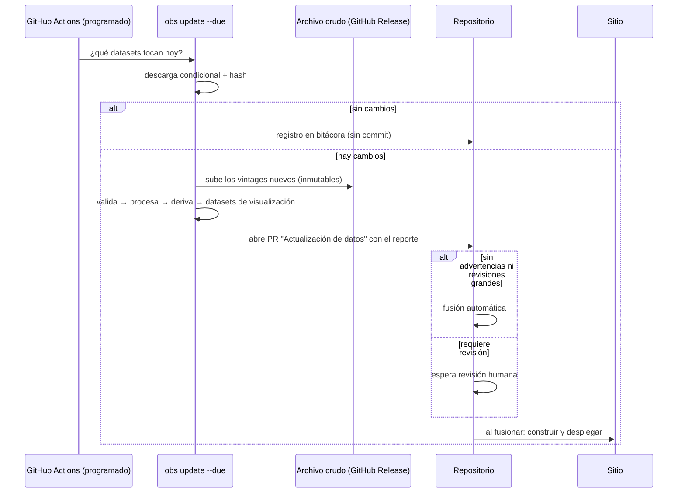

# 07 · Estrategia de actualización

## 1. Principios

1. **Calendario según la fuente.** Se consulta cada dataset cuando es probable que haya
   datos nuevos (según su frecuencia y su calendario de publicación), no todo cada día.
2. **Detección de cambios barata.** Peticiones condicionales y comparación de hash: si no
   cambió nada, no se procesa nada.
3. **Humano en el circuito para lo inusual.** Lo rutinario se publica solo; lo raro
   (revisiones grandes, rupturas, discrepancias nuevas, cambios de metodología) espera revisión.
4. **Último dato válido.** Una fuente caída o con datos inválidos nunca rompe el sitio.
5. **Frescura visible.** El sitio muestra qué tan actualizado está cada dataset.

## 2. Frecuencias de consulta

| Nivel | Cuándo se consulta | Ejemplos |
|---|---|---|
| Diario (días hábiles) | Una vez al día | Tipo de cambio y tasas (Banxico) |
| Según calendario | El día de publicación programado + 1 día de margen | INEGI (calendario de difusión anual), Banxico, SESNSP (mensual) |
| Mensual | Primera semana del mes | IMSS, SHCP |
| Trimestral | Al inicio de cada trimestre | Banco Mundial (WDI, PIP), ENSU |
| Anual / eventual | En el mes esperado + revisiones semanales durante ese mes | V-Dem (marzo), FMI WEO (abril y octubre), Freedom House, ONU WPP |

El calendario de difusión de INEGI se puede ingerir como un dataset más para programar las consultas automáticamente.

## 3. Flujo automatizado

**Qué contiene el PR de actualización:**

- el cambio en `catalog/vintages.lock.yaml` (qué datasets avanzan de versión);
- un reporte legible: periodos nuevos, revisiones (con magnitud), controles con
  advertencia, discrepancias nuevas y gráficas afectadas;
- capturas de las gráficas afectadas, antes y después (fase 2).

Como los datos no viven en git, el historial del *lockfile* es **el historial de versiones
de datos del observatorio**: cada commit dice exactamente qué datos alimentaron el sitio.

## 4. Monitoreo de frescura y salud

- Cada dataset declara su frecuencia y su rezago esperado. La página **Estado de los datos**
  muestra: último periodo disponible, fecha de la última consulta y de la última
  actualización, próxima publicación esperada y estado (al día · con retraso · con fallas).
- **Pruebas de contrato semanales:** cada conector hace una petición mínima y verifica que la
  respuesta conserve la estructura esperada. Así detectamos cambios de API antes de que
  coincidan con una publicación importante.
- **Alertas:** una falla persistente o un retraso abre automáticamente un *issue* en GitHub con el diagnóstico.

## 5. Cambios de metodología anunciados

Cuando una fuente anuncia un cambio (año base nuevo, nueva ronda de PPA, cambio de
institución responsable):

1. Se registra como **evento metodológico** en el catálogo, con fecha y documento de la fuente.
2. Si la serie nueva no es comparable con la anterior, se crea una **serie nueva** en el
   catálogo; la anterior se conserva.
3. Si se empalman, el método se documenta (`empalme_razon@1` u otro) y la gráfica lo anota.
4. Las fichas de los indicadores afectados muestran la ruptura.

## 6. Detalles prácticos a prever

| Asunto | Prevención |
|---|---|
| GitHub desactiva los flujos programados tras 60 días sin actividad en repositorios públicos | Los PR de actualización generan actividad; además, una alerta si un flujo se desactiva. |
| Tokens que expiran o se revocan (INEGI, Banxico, Comtrade) | Prueba de credenciales en la verificación semanal. |
| Límites de tasa | Esperas por fuente y descargas incrementales. |
| Zonas horarias | Todo en UTC internamente; fechas de publicación en hora de Ciudad de México en la interfaz. |
| Portales que cambian sin aviso (archivos en páginas web) | Pruebas de contrato + localización del archivo por patrones, no por posición. |

## 7. Ritmo de revisión humana

| Frecuencia | Actividad | Tiempo estimado |
|---|---|---|
| Semanal | Revisar los PR de actualización con advertencias | 15–30 min |
| Mensual | Revisar discrepancias abiertas, valores atípicos pendientes y frescura | 1 h |
| Trimestral | Publicar una instantánea de datos (opcional: DOI en Zenodo) | 30 min |
| Anual | Revisar el conjunto de indicadores, los grupos de comparación y los criterios de eventos; escribir la bitácora anual de cambios | Medio día |
